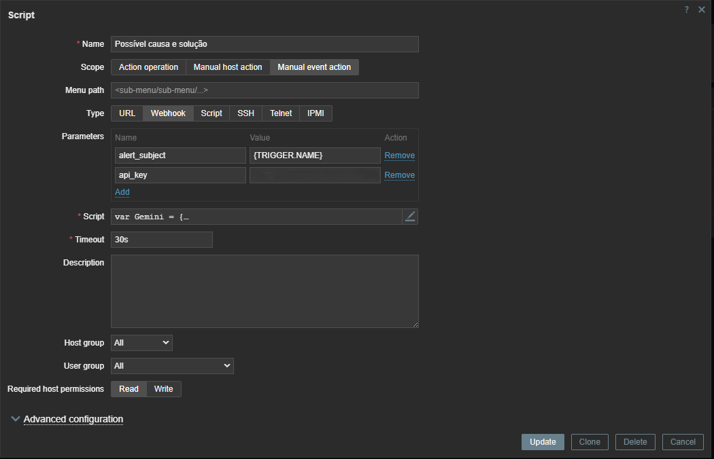

# 🤖 Integração Zabbix com Inteligência Artificial Gemini

Este projeto tem como objetivo integrar o **Zabbix** com a ferramenta de inteligência artificial **Google Gemini**, utilizando a API fornecida pelo **Google AI Studio**. Com isso, é possível analisar automaticamente os alertas do Zabbix, obtendo **possíveis causas e soluções** sugeridas pela IA, além de usar um **widget personalizado** para diagnósticos avançados.

---

## 🚀 Funcionalidades

- 🔍 Identificação de **causas prováveis** para alertas
- 💡 Sugestões de **soluções automáticas**
- 📉 Otimização dos thresholds e regras de monitoramento
- 📊 Criação de um widget IA: **"Em que você está trabalhando?"**
- 📚 Suporte a implementação local com modelos open source (HuggingFace)

---

## 📦 Repositório

🔗 Repositório Oficial:  
[https://github.com/GuilhermeGaffuri/zabbixIA](https://github.com/GuilhermeGaffuri/zabbixIA)

---

## ✨ Requisitos

- Zabbix versão **7.0** ou superior
- Conta no [Google AI Studio](https://aistudio.google.com/)
- Chave de API da plataforma Gemini
- Acesso ao servidor onde o Zabbix está instalado (para widget local)

---

## 🧠 Obtenha sua API do Gemini

1. Acesse: [https://aistudio.google.com/](https://aistudio.google.com/)
2. Faça login com sua conta Google
3. Crie um projeto e gere sua **API Key**
4. Salve a chave — ela será usada nas próximas etapas

---

## 🔧 Instalação do Script de IA no Zabbix

### Passo 1: Acesse o Zabbix
- Vá em **Configuração > Ações > Scripts**
- Clique em **Criar Script**

### Passo 2: Preencha as informações
- **Nome:** Causa possível e solução
- **Tipo:** Script personalizado
- **Parâmetros:** defina os parâmetros conforme o trigger
- **Script:** copie o conteúdo do arquivo [`script-zabbix-gemini.sh`](https://github.com/GuilhermeGaffuri/zabbixIA/blob/main/script-zabbix-gemini.sh)

> ⚠️ **Não esqueça de substituir `YOUR_API_KEY` pela sua chave do Gemini no script.**
<<<<<<< HEAD

=======
>>>>>>> 3e7bf77d99f30def7cd141380ef3e5ec4f2f4226

---

## 🖥️ Aplicação no Painel de Problemas

1. Vá ao painel de problemas do Zabbix
2. Clique em um alerta
3. Selecione o botão **"Assistente IA"**
4. Escolha a ação **"Causa possível e solução"**

A IA responderá com um diagnóstico e solução baseada no alerta atual.

---

## 🧩 Instalação do Widget IA "Em que você está trabalhando?"

### Backend

1. No servidor, acesse:
   ```bash
   cd /usr/share/zabbix/widgets/
<<<<<<< HEAD


## 🖥️ Frontend

1. Vá até **Administração > Geral > Módulos**
2. Clique em **"Procurar Diretório"**
3. Ative o widget **"Insights"** (ele está desativado por padrão)

---

## 📈 Exemplo de uso: Análise de Disco

Utilizando o widget com alertas de disco no servidor Zabbix, a IA pode:

- 📌 **Diagnosticar a causa**  
  *(Exemplo: espaço ocupado por logs antigos)*

- 💬 **Sugerir solução**  
  *(Exemplo: rotacionar ou limpar arquivos de log)*

- 🔮 **Prever tendências de uso**  
  *(Com base nos dados do painel de monitoramento)*

---

## 🌐 Implementação Local com Modelos Open Source (opcional)

Você pode substituir o Google Gemini por modelos de IA **open source**, como os disponíveis na **HuggingFace** ou outros LLMs locais. Para isso:

1. **Instale** o modelo local em um servidor dedicado
2. **Adapte** o script para fazer requisições à sua API local
3. **Crie um banco de dados** com alertas e respostas anteriores
4. A IA irá **aprender com eventos recorrentes** e oferecer soluções mais precisas ao longo do tempo
=======
>>>>>>> 3e7bf77d99f30def7cd141380ef3e5ec4f2f4226
