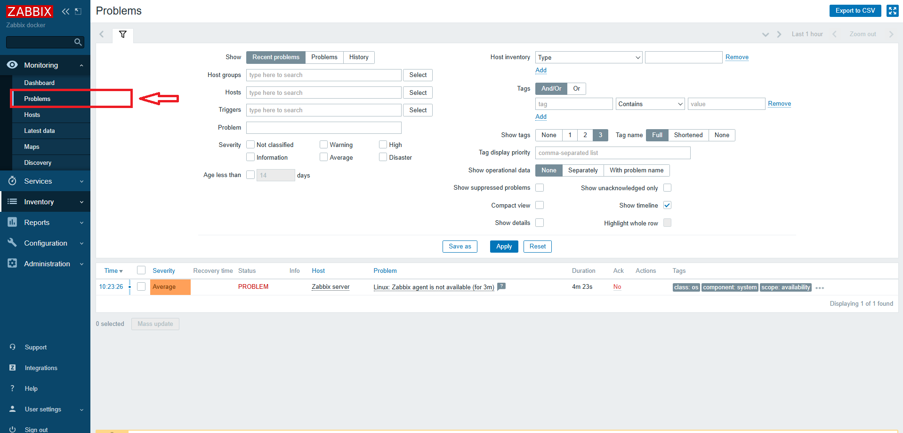
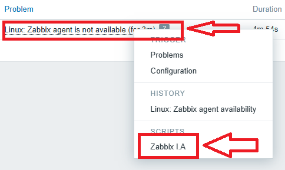
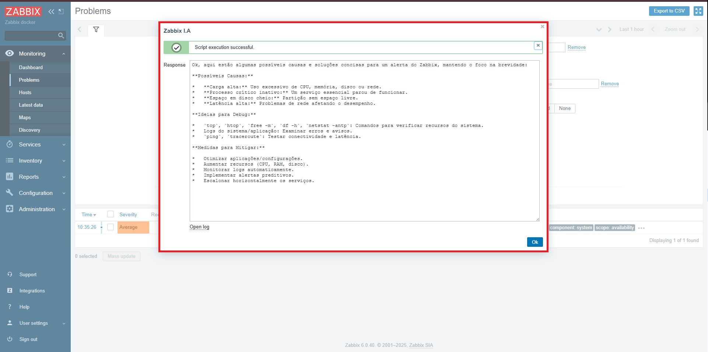

# Integração Zabbix com Inteligência Artificial Gemini

Este projeto tem como objetivo integrar o **Zabbix** com a ferramenta de inteligência artificial **Google Gemini**, utilizando a API fornecida pelo **Google AI Studio em PT-BR**. Com isso, é possível analisar automaticamente os alertas do Zabbix, obtendo **possíveis causas e soluções** sugeridas pela IA, além de usar um **widget personalizado** para diagnósticos avançados.

---

## Repositório

🔗 Repositório Oficial:  
[https://github.com/GuilhermeGaffuri/zabbixIA](https://github.com/GuilhermeGaffuri/zabbixIA)

---

## Requisitos

- Zabbix versão **7.0** ou superior
- Conta no [Google AI Studio](https://aistudio.google.com/)
- Chave de API da plataforma Gemini
- Acesso ao Zabbix como adm

---

## Obtenha sua API do Gemini

1. Acesse: [https://aistudio.google.com/](https://aistudio.google.com/)
2. Faça login com sua conta Google
3. Crie um projeto e gere sua **API Key**
4. Salve a chave — ela será usada nas próximas etapas

---

## Instalação do Script de IA no Zabbix

### Passo 1: Acesse o Zabbix
- Vá em **Configuração > Ações > Scripts**
- Clique em **Criar Script**

### Passo 2: Preencha as informações
- **Nome:** Causa possível e solução
- **Tipo:** Script personalizado

 

- **Parâmetros:** defina os parâmetros conforme o trigger
- **Script:** copie o conteúdo do arquivo [`script-zabbix-gemini.sh`](https://github.com/GuilhermeGaffuri/zabbixIA/blob/main/script-zabbix-gemini.sh)

> ⚠️ **Não esqueça de substituir `YOUR_API_KEY` pela sua chave do Gemini no script.**

---

## Como utilizar

1. Vá ao painel de problemas do Zabbix

2. Clique em um alerta
3. Selecione o botão **"Assistente IA"**

4. Escolha a ação **"Causa possível e solução"**

---

## Créditos

Este projeto foi originalmente baseado no script desenvolvido por **Cesar Caceres**, publicado no blog oficial do Zabbix:

🔗 [Criando um assistente pessoal no Zabbix com Inteligência Artificial – por Cesar Caceres](https://blog.zabbix.com/creating-a-personal-assistant-in-zabbix-with-artificial-intelligence/29596/)

O script original estava em **espanhol**. Esta versão foi adaptada e traduzida para o **português brasileiro (PT-BR)** com o objetivo de facilitar a compreensão e o uso por usuários da comunidade brasileira.
